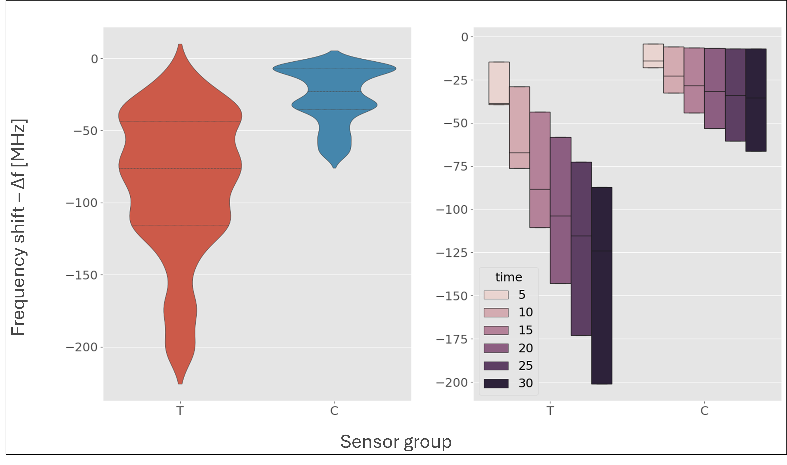

# Summary

Generating, plotting, and analyzing signal data is time-consuming. In a context where the demand for rapid diagnostics is increasing, the assistance of intelligent processes that abstract a significant portion of the work is essential. Analix is a software that reads frequency data generated when magnetoelastic sensors are subjected to an environment containing an external agent (such as SARS-CoV-2). Magnetoelastic sensors have a fundamental vibration frequency, which decreases when their mass increases. In controlled experiments, functionalized magnetoelastic sensors with an active surface were divided into test and control groups. The test sensors were exposed to a medium containing the virus, and their vibration frequency was collected using a network analyzer, as well as the result of collecting vibrations from the control sensors. The Analix software compared the results, proposing a safe and fast way to provide a diagnosis regarding the presence or absence of an external agent. Machine learning classifiers were used to generate a portable model applicable in different scenarios. This work demonstrates the construction of the analysis routine to the final model.


# Statement of need

The primary objective of this project is to develop a software for analyzing data from magnetoelastic sensors, focusing on the efficient detection of pathogens. Utilizing advanced techniques such as statistical data analysis and machine learning algorithms, the software aims to provide a robust tool for the rapid and accurate identification of pathogenic agents, such as viruses and bacteria, which pose threats to public health.

To achieve this overarching goal, the project sets specific targets that include evaluating data from functionalized magnetoelastic sensors to detect the presence of the SARS-CoV-2 virus; developing a predictive model based on the fitting of data curves from a network analyzer; and establishing a system capable of assessing with high precision the presence or absence of viruses, employing machine learning classifier algorithms into a Jupyter notebook. 

The relevance of this approach is evident when considering the backdrop of the pandemic scenario that developed between 2020 and 2022, which continues to manifest its effects today, in addition to the increase in dengue cases in Brazil. Such a context has demonstrated the need for tools that enable the rapid diagnosis of certain diseases, such as COVID-19 and other viral infections, to be obtained swiftly, with high detection efficiency and at a reduced cost.

# A brief literature review

Over the past decade, several deadly viral epidemics have had a significant impact on global public health, including outbreaks of Ebola, Marburg, Nipah, Zika, Crimean-Congo hemorrhagic fever, COVID-19, and dengue. These epidemics underscore the need for rapid and accurate detection methods, as well as the development of effective drugs and vaccines [@frieden1:2014; @cdc2:2023; @rougeron3:2015; @cdc4:2023; @yadav5:2019; @who6:2018; @leal7:2017; @paho15:2024].

Sensors made with magnetoelastic materials, combined with machine learning models, can be an ally in the race for rapid detection mechanisms. These sensors are sensitive, precise, and reliable, and can operate over a wide range of temperatures and frequencies. They are also less susceptible to electromagnetic interference and can be integrated into devices with embedded electronics [@cdc8:2023; @bente9:2013; @who10:2022].

Biomedicine is an area that has benefited from sensors constructed from magnetoelastic materials, such as Magnetoelastic Biosensors (MBS). They are applied in monitoring biological parameters and can be used to detect the presence of bacteria and viruses, such as the SARS-CoV-2 coronavirus. The use of machine learning for classification can increase the sensitivity and accuracy of diagnosis [@cdc11:2023; @who12:2023; @ms13:2023; @barreto14:2008].

Magnetoelasticity, like magnetostriction, is a property involving the change in magnetization of ferromagnetic materials due to the application of stress or strain. Magnetostriction, discovered by Joule in 1842, involves the deformation of ferromagnetic materials when exposed to external magnetic fields. Magnetoelasticity is influenced by the magnetostriction constant, the anisotropic constant, and the material’s magnetization, and its sensitivity to stress is maximized when the applied stress approaches $2K/3$. Magnetoelastic sensors (MES) utilize the magnetoelastic effect to measure physical quantities such as stress, pressure, temperature, strain, or electric current. They are manufactured from amorphous metal alloys, commercially known as Metglas 2826MB and Metglas 2605SC, and are capable of detecting mechanical vibrations induced by magnetic fields. These sensors have diverse applications, ranging from wireless monitoring of tires and machine shafts to the detection of vibrations in civil constructions and the monitoring of biological parameters, such as the pH of plasma in the human body [@grimes16:2011; @jackson17:2019; @ausanio18:2005; @vander32:2000; @ludwig33:2002;@cai34:2000; @baran35:2011; @engdahl36:2000; @sablik37:1993; @szewczyk38:2008; @cullen39:2001; @desmione40:2002; @grimes41:2002; @hernando42:1988; @modzelewski43:1981; @jain44:2001; @croce45:2014; @mori46:2021; @khan47:2017; @kouz48:2000; @narita49:2021].

Magnetoelastic sensors exhibit a fundamental frequency, which takes into account the length $(L)$ of the sensor, its modulus of elasticity $(E)$, Poisson’s ratio $(\nu)$, and the density $(\rho)$ of the alloy from which it is made, defined by the following equation [@sisniega50:2020]:

$$f_0 = \frac{1}{2L} \sqrt{\frac{E}{\rho(1 - \nu)}}$$

Artificial intelligence and machine learning are fundamental in enhancing detection and diagnosis using MES. Artificial intelligence enables the development of systems capable of performing tasks that require human intelligence, such as pattern recognition and decision-making. Machine learning, a subfield of artificial intelligence, focuses on developing algorithms that learn from data. Techniques like the bootstrap method, a statistical resampling method, are used to estimate statistics from a data sample, contributing to the analysis and interpretation of sensor signals [@mellit51:2008; @moor52:2006; @mccarthy53:1956; @domingos54:2012; @nilsson56:2013; @bishop57:2006; @macario58:2009; @sas59; @amaral60:2016; @shalev61:2014; @brownlee62:2016; @monard63:2003; @efron69:2000; @davison70:1997].

# Methodology

The sensors, obtained from Metglas 2826MB3 by Metglas Company, were fabricated into dimensions of 5 mm x 1 mm x 28 μm for optimal vibration modes. They were coated with chrome and gold using magnetron sputtering. Measurements were conducted using electromagnetic coils connected to a Keysight E5061B network analyzer and a DC power source, that reads the vibrational behavior of the sensors as a response to de signal from the analizer coils, as shown in \autoref{fig:sensor_reading}.


A dataset comprising two groups, test and control, each containing data from three sensors, totaling 6 sensors, was assembled. Each sensor underwent a 30-minute measurement cycle using a network analyzer, with data collected every 5 minutes, including t = 0, resulting in 7 subsets of data per sensor, with 201 signal and frequency readings per group. The frequency range tested was between 430,000 Hz and 460,000 Hz, encompassing the characteristic resonance frequency of the sensor material. The final dataset consisted of frequency and signal data from all sensor cycles for each group, totaling 8442 rows. 


A hash column was created as a reference field for analysis, combining group (test or control), sensor number, and time of signal acquisition (run). A developed software processed frequency and signal data, capturing values around the estimated peak and fitting an asymmetric Lorentzian curve. The minimum point of this curve was the point of interest for analysis, as it measured the frequency shift used to identify sensor mass changes, indicating the presence of new materials like viruses. Monte Carlo simulation evaluated the statistical significance of the points of interest, with 1000 iterations for each sensor in both groups at each time interval. The resulting dataset contained minimized frequency values and their uncertainties, enabling the plotting of average frequency graphs over time. 


Lagergren's equation was employed to fit frequency data over time, facilitating precise comparison of frequency shifts between test and control sensors. Bootstrap method was applied to obtain randomly selected data points for classifiers, with 85% of data used for training and the remaining 15% for testing. Seven different classifiers were trained, including logistic regression, decision tree, random forest, Ada boost, gradient boosting, naive Bayes, k-nearest neighbors, and support vector machines with five-fold cross-validation. 


# Usage

In order to use the software, network analizer results must be inside a folder, splited into two subfolders named *C* and *T* (control and test). Once the notebook is started, after packages are imported, a window pops up, where it is possible to select the main folder where *C* and *T* subfolders are stored. The notebook can be ran cell by cell or in run-all mode. Templates and examples can be found at the [project repository](https://github.com/andreatta-ale/external-agents-detector).


# Discussion

For the case studied in this project, the adjustment of network analyzer data to the asymmetric Lorentzian model for all sensor datasets resulted in a clustering of parameters from each modeling iteration, accompanied by uncertainty values. This served as the basis for a Monte Carlo simulation, where parameters and uncertainties were applied, producing a dataset optimized for minimum signal value at a specific frequency. Subsequent analysis revealed frequency shifts in test sensor data, which were then adjusted to the Lagergren equation model to obtain $\Delta{f}$ values. These shifts were observable in graphs depicting data curves adjusted to the Lagergren model, highlighting distinctions between sensor groups.


The Bootstrap method was employed to generate a larger dataset, showcasing significant separation between control and test data means, despite the presence of an indistinct zone. This expanded dataset was utilized to train a model comprising seven classifiers, including SVM classifiers with three methods. The model's performance was evaluated using a confusion matrix, revealing overfitting due to the small original dataset. Despite limitations in data availability, the proposed strategy proved effective in differentiating sensor groups, underscoring the importance of predictive technologies in rapidly diagnosing viral diseases.




Moving forward, this study proposes further exploration by extrapolating analyses to other viruses beyond SARS-CoV-2, and extending applications to detecting harmful bacteria in both medical and veterinary contexts. Additionally, experiments on sensors of different formats are suggested to assess the computational approach's sensitivity to SME geometry variations, offering avenues for future research and development in disease detection and classification. To do so, the source code can be adapted and tested under different sensoring and measurement systems.

# Examples

#### Importing packages.


```python
import glob
import itertools
import math
import os
import pickle
import shutil
import warnings
from datetime import date, datetime

import matplotlib.pyplot as plt
import numpy as np
import pandas as pd
import seaborn as sns
from scipy import optimize, stats
from scipy.optimize import curve_fit
from scipy.signal import argrelmax, find_peaks, hilbert, peak_widths
from scipy.stats import norm
from tabulate import tabulate
from tkinter import filedialog, Tk
from uncertainties import ufloat, unumpy
from uncertainties.umath import *

from lmfit import Minimizer, Model, Parameters, report_fit
from lmfit.models import LinearModel, SplitLorentzianModel

pd.set_option('display.max_rows', 50)
warnings.filterwarnings('ignore')
plt.style.use('ggplot')
%matplotlib inline
```

#### Selecting data folder. It creates result folder for output saving.


```python
root = Tk()
root.withdraw()
folder_path = filedialog.askdirectory()
print('Folder path: ', folder_path)

file_path = os.path.join(folder_path, '**/*.csv')
result_folder = 'res'
folder = os.path.join(folder_path, result_folder)

if os.path.isdir(folder):
    print('Result folder already exists, cleaning...')
    try:
        shutil.rmtree(folder)
    except OSError as e:
        print(f"Error: {folder} : {e.strerror}")
os.mkdir(folder)
print('Result folder created.')

print('-----------------------------------------\n')
print('Result folder path: ', folder)
print('-----------------------------------------\n')

### Logging
log_file = os.path.join(folder, 'log.txt')

with open(log_file, 'w') as f:
    f.write(f"{datetime.now()} - {folder}")
```


    Folder path:  C:/Users/my_user/Documents/Analix/...
    Result folder already exists, cleaning...
    Result folder created.
    -----------------------------------------
    
    Result folder path:  C:/Users/my_user/Documents/Analix/...
    -----------------------------------------
    
    
#### Acquiring individual files addresses. 
Splits into group, sensor and time, adding a hash column used for filtering data.


```python
files = pd.DataFrame(glob.glob(file_path,recursive = True),columns = ['Path'])

def extract_info(path):
    group = path.split('/')[-1].split('\\')[-3]
    sensor = path.split('/')[-1].split('\\')[-2]
    k = path.rfind('\\')
    time = int(path[k + 1:].replace('.CSV', ''))
    hash = f"{group}-{sensor}-{time}"
    return pd.Series([group, sensor, time, hash])

files[['group', 'sensor', 'time', 'hash']] = files['Path'].apply(extract_info)

addresses = files.rename(columns={'Path': 'address'}).sort_values(
    by=['group','sensor','time','address'], 
    ignore_index=True, 
    ascending=True
)

print('-----------------------------------------\n')

text = 'Analysis'

print(text + '\n')

print('-----------------------------------------\n')

addresses.head()
```

    -----------------------------------------
    
    Analysis
    
    -----------------------------------------
    


#### This cell provides intel on quantity of files to be scanned:


```python
space = len(addresses.index)
print('Space: ', space)
today = date.today()

### Logging

files_address_list = f'{datetime.now()} - Address list - OK \n'

with open(log_file, 'a') as f:
    f.write(files_address_list)

addresses = addresses.reset_index(drop=True).set_index('address')
```

    Space:  42
    

#### Scans the addresses data frame
Reads data of each file and assembles them into a combined data frame, that contains frequency and signal data. 
Also, rescales frequency values to signal's order of magnitude (multiplied by $1 \times 10^{-6}$)


```python
def process_path(path):
    group = addresses.loc[path,'group']
    sensor = addresses.loc[path,'sensor']
    time = addresses.loc[path,'time']
    hashed = addresses.loc[path,'hash']

    df_import = pd.DataFrame(pd.read_csv(path, skiprows=range(0, 2)))
    df_import.drop(df_import.columns[2], axis=1, inplace=True)
    df_import.columns.values[0] = 'frequency'
    df_import.columns.values[1] = 'signal'
    df_import['group'] = group
    df_import['sensor'] = sensor                                          
    df_import['time'] = time
    df_import['hash'] = hashed

    return df_import

dfs = addresses.index.map(process_path)
combined_df = pd.concat(dfs, ignore_index=True)

combined_df['frequency'] = combined_df['frequency'] * 1.e-6
combined_df.head()
```


Split Lorentzian function, used to fit data to model:

$f(x; A, \mu, \sigma, \sigma_r) = \frac{2 A}{\pi (\sigma+\sigma_r)} \big[\frac{\sigma^2}{(x - \mu)^2 + \sigma^2} * H(\mu-x) + \frac{\sigma_r^2}{(x - \mu)^2 + \sigma_r^2} * H(x-\mu)\big] + (m x + b)$

Applies fitting model (Lorentzian) to each experimental dataset, retrieving a evaluation dataset based on the model. After fitting, applies an optimization function over a Monte Carlo Simulation to find the interesting point: the minimized frequency used to evaluate delocation on passing time of experiment

For each instance of time, plots original data, accuracy rate between Monte Carlo Simulation average frequency and minimized average frequency, and fitted curve over original data, pinpointing those values alongside minimal point from original data.


```python
def SplitLorentzianFunc(x, aux):
    # Calculate the amplitude of the Lorentzian function
    amplitude = ((2 * aux[0]) / (np.pi * (aux[2] + aux[3])))
    
    # Calculate the Lorentzian function for the lower and upper halves
    lower_half = ((aux[2] ** 2) / (((x - aux[1]) ** 2) + aux[2] ** 2))
    upper_half = ((aux[3] ** 2) / (((x - aux[1]) ** 2) + aux[3] ** 2))
    
    # Calculate the Heaviside step function for the lower and upper halves
    step_lower = np.heaviside(aux[1] - x, 0)
    step_upper = np.heaviside(x - aux[1], 0)
    
    # Calculate the linear function
    linear_func = (aux[4] * x + aux[5])

    # Return the sum of the Lorentzian function and the linear function
    return (amplitude * ((lower_half * step_lower) + \ 
        (upper_half * step_upper))) + linear_func

def create_evaluate_df(x_eval, y_eval, hashed):
    evaluate_df = pd.DataFrame(x_eval, columns=['x_eval'])
    evaluate_df['y_eval'] = y_eval
    evaluate_df['hash'] = hashed
    return evaluate_df


def process_data(combined_df, log_file):
    unique_hash = combined_df.hash.unique()
    dfs_params = []
    dfs_eval = []
    frequency_shift = []

    for i in unique_hash:
        hashed = i
        xy0 = combined_df[['frequency','signal']].loc[combined_df['hash'] == hashed]
        xy0 = xy0.reset_index(drop=True)

        interval = 13
        min_value_idx = xy0.loc[xy0['signal'] == xy0['signal'].min()].index[0]
        idx = range(min_value_idx - interval, min_value_idx + interval)

        x = np.array(xy0['frequency'])[idx]
        y = np.array(xy0['signal'])[idx]
        
        # Model parametrization
        peak = SplitLorentzianModel() #prefix='slm_')
        linemod1 = LinearModel() #prefix='lm1_')
        #linemod2 = LinearModel(prefix='lm2_')
        pars = Parameters()
        pars += peak.guess(y, x=x)
        pars += linemod1.make_params(intercept=y.min(), slope=0)
        #pars += linemod2.make_params(intercept=y.min(), slope=0)
        mod = linemod1 + peak # + linemod2

        # Fit model
        result = mod.fit(y, pars, x=x)
        
        # Printing report and related information
        print(result.fit_report(min_correl=0.25))

        ### Logging

        lmfit_report = f'\n{str(datetime.now())} - LMFIT result report {i} \n' + \
            str(result.fit_report(min_correl=0.25))

        with open(log_file, 'a') as f:
            f.write(lmfit_report)
        
        # Determining the point to be evaluated on the frequency shift   
        x_eval = np.linspace(min(x), max(x), num = 10000)
        y_eval = result.eval(result.params, x=x_eval)

        evaluate_df = pd.DataFrame(x_eval, columns=['x_eval'])
        evaluate_df['y_eval'] = y_eval
        evaluate_df['hash'] = hashed
        
        plot_x = evaluate_df['x_eval'].loc[
            evaluate_df['y_eval'] == evaluate_df['y_eval'].min()
        ]
        plot_y = evaluate_df['y_eval'].loc[
            evaluate_df['y_eval'] == evaluate_df['y_eval'].min()
        ]

        # Min point
        minimized_freq = []

        n = 1000
        
        for j in range(n):
            aux = np.array([
                np.random.normal( # 0
                    loc=result.params['amplitude'].value, 
                    scale=result.params['amplitude'].stderr
                ),
                np.random.normal( # 1
                    loc=result.params['center'].value, 
                    scale=result.params['center'].stderr
                ), 
                np.random.normal( # 2
                    loc=result.params['sigma'].value, 
                    scale=result.params['sigma'].stderr
                ),
                np.random.normal( # 3
                    loc=result.params['sigma_r'].value, 
                    scale=result.params['sigma_r'].stderr
                ),
                np.random.normal( # 4
                    loc=result.params['slope'].value, 
                    scale=result.params['slope'].stderr
                ),
                np.random.normal( # 5
                    loc=result.params['intercept'].value, 
                    scale=result.params['intercept'].stderr
                    )
                ])

            find_fmin = optimize.fmin(
                lambda x: SplitLorentzianFunc(x, aux),
                xy0['frequency'][min_value_idx], 
                full_output=True,
                disp=0
            )
    
            find_fmin_point = np.array([find_fmin[0].item(), find_fmin[1]])
    
            minimized_freq.append(find_fmin[0])
    
            j = j + 1

        minimized_freq = np.concatenate(minimized_freq).ravel()
        minimized_freq = minimized_freq[
            (minimized_freq > 0.43) & (minimized_freq < 0.444)
        ]
        
        minimized_freq_mean = np.array(minimized_freq).mean()
        minimized_freq_std = np.array(minimized_freq).std()
        minimized_freq_std_err = minimized_freq_std / np.sqrt(n)
        freq = ufloat(minimized_freq_mean,minimized_freq_std)*1e6
        pfloat = minimized_freq_mean/plot_x.values.item()
        
        values_lst = [
            minimized_freq_mean, 
            minimized_freq_std, 
            minimized_freq_std_err,
            freq,
            hashed
        ]
        
        dfs_params.append(values_lst)
        
        print('\n')
        print('----- Results -----')
        
        def create_result_table(
            minimized_freq_mean, 
            minimized_freq_std, 
            minimized_freq_std_err, 
            freq, 
            pfloat
        ):
            result_table = [
                ['Optimized frequency mean (fmin)', minimized_freq_mean],
                ['Optimized frequency standard deviation (fmin)', minimized_freq_std],
                ['Optimized frequency standard error (fmin)', minimized_freq_std_err],
                ['Optimized frequency mean with uncertainties', freq],
                ['Accuracy of estimated frequency mean / SMC',pfloat]
            ]
            return result_table
        
        result_table = create_result_table(
            minimized_freq_mean, 
            minimized_freq_std, 
            minimized_freq_std_err, 
            freq, 
            pfloat)
        print(str(tabulate(result_table)))
        print('\n')
        
        ### Logging
        
        variables_report = f'{datetime.now()} - Results {i} \n' + \
            str(tabulate(result_table)) + '\n'
        
        with open(log_file, 'a') as f:
            f.write(variables_report)
            
        # PLOTING
    
        # Primary data
        plt.figure()
        plt.rcParams.update({'font.size': 18})
        ax = xy0.plot(
            x = 'frequency', 
            y = 'signal', 
            kind='scatter',
            figsize = (16,4), 
            grid=True, 
            legend=True
        )
        ax.set_title(
            label = 'Initial data ' + hashed, 
            pad=20, 
            fontdict={'fontsize':20}
        )
        ax.set_xlabel('Frequency [MHz]')
        ax.set_ylabel('Signal')
        plt.show()
        print('\n')
        
        #Accuracy between minimized frequency mean and MCS frequency mean
        xfloat = np.linspace(0.98, 1.02, num = 100)
        yfloat = np.linspace(0, 0, num = 100)
        fig = plt.figure(figsize = (16,4))
        plt.plot(xfloat,yfloat)
        plt.plot(pfloat,0,color='k',marker='|', markersize = 15, 
            label='Optimized frequency mean LMFIT / Optimized frequency mean SMC')
        plt.text(
            x=pfloat, 
            y=0.02, 
            s='Accuracy:    {:.8}'.format(pfloat), 
            horizontalalignment='right',
            verticalalignment='baseline'
        ) 
        plt.legend(loc='best')
        plt.title(
            'Accuracy between frequency mean LMFIT and ' + \
            'SMC optimized frequency mean', 
            fontsize=20
        )
        plt.show()
        
        # Fit model data plot    
        fig = plt.figure(figsize = (16,8))
        plt.plot(x, y, 'o')
        plt.plot(x_eval, y_eval, 'r-', label='Best fit')
    
        plt.plot(
            xy0['frequency'][min_value_idx],
            xy0['signal'][min_value_idx],
            marker = 'D',
            color='orange', 
            markersize=8,
            label='Original data minimum frequency'
        )
        
        labels = evaluate_df['hash'].loc[
            evaluate_df['y_eval'] == evaluate_df['y_eval'].min()
        ]
        
        plt.plot(
            plot_x, 
            plot_y, 
            label='Lorentz minimum frequency (LMFIT)', 
            color='green', 
            marker='s', 
            markersize=8
        )
        plt.plot(
            minimized_freq_mean, 
            plot_y, 
            label='SMC average frequency', 
            color='k', 
            marker='o', 
            markersize=8
        )
        plt.xlabel('Frequency [MHz]')
        plt.ylabel('Signal')
        plt.legend(loc='best')
        plt.title(
            'Signal vs frequency: ' + \
            'Lorentz function fit and points of interest '+ hashed, 
            fontsize=20
        )
        plt.grid(True)
        plt.show()

        global eval_df
        
        dfs_eval.append(evaluate_df)
        
        print('Eval appended.')
        print('--------------------------------\n')
    eval_df = pd.concat(dfs_eval, ignore_index=True)
    param_df = pd.DataFrame(
        dfs_params, 
        columns=[
            'minimized_freq_mean',
            'minimized_freq_std',
            'minimized_freq_std_err',
            'freq_with_unc', 
            'hash'
        ]
    )
    return eval_df, param_df
```

##### Running the model builder:


```python
eval_df, param_df = process_data(combined_df, log_file)
```

Fist outputs:

    [[Model]]
        (Model(linear) + Model(split_lorentzian))
    [[Fit Statistics]]
        # fitting method   = leastsq
        # function evals   = 57
        # data points      = 26
        # variables        = 6
        chi-square         = 1.0762e-06
        reduced chi-square = 5.3809e-08
        Akaike info crit   = -430.004968
        Bayesian info crit = -422.456389
        R-squared          = 0.99987217
    [[Variables]]
        amplitude: -6.5548e-04 +/- 1.1665e-05 (1.78%) (init = 0.000562349)
        center:     0.43904624 +/- 6.0215e-06 (0.00%) (init = 0.4389636)
        sigma:      0.00229330 +/- 3.7278e-05 (1.63%) (init = 0.0025)
        sigma_r:    0.00216150 +/- 2.9597e-05 (1.37%) (init = 0.0025)
        fwhm:       0.00445480 +/- 4.0914e-05 (0.92%) == 'sigma+sigma_r'
        height:    -0.09367237 +/- 8.2562e-04 (0.88%) == 
            '2*amplitude/3.1415927/max(0.0000000, (sigma+sigma_r))'
        slope:     -4.08629682 +/- 0.23477583 (5.75%) (init = 0)
        intercept:  2.36979826 +/- 0.10330544 (4.36%) (init = 0.4819135)
    [[Correlations]] (unreported correlations are < 0.250)
        C(slope, intercept)     = -1.0000
        C(sigma, intercept)     = +0.8389
        C(sigma, slope)         = -0.8350
        C(amplitude, sigma)     = -0.7051
        C(sigma_r, slope)       = +0.6686
        C(sigma_r, intercept)   = -0.6631
        C(center, sigma_r)      = -0.5404
        C(amplitude, sigma_r)   = -0.4793
        C(center, sigma)        = +0.4013
        C(center, slope)        = -0.3272
        C(center, intercept)    = +0.3261
        C(amplitude, intercept) = -0.2817
        C(amplitude, slope)     = +0.2739
        C(sigma, sigma_r)       = -0.2681
    
    
    ----- Results -----
    ---------------------------------------------  ----------------------
    Optimized frequency mean (fmin)                0.4391199030496987
    Optimized frequency standard deviation (fmin)  2.1337644445234708e-05
    Optimized frequency standard error (fmin)      6.747555634978163e-07
    Optimized frequency mean with uncertainties    439120+/-21
    Accuracy of estimated frequency mean / SMC     0.9999343005633774
    ---------------------------------------------  ----------------------

   


    

    


    Eval appended.
    --------------------------------
    
    (...)


Applies a Lagergren model over minimized data in order to obtain a model for frequency decay on time and provides a detailed report on fit params of the model. 
As result of this process, it is possilbe to estimate frequency shift of each time instance.


```python
def fit_model(t, f0, a, c):
    return f0 * (1 - a * (1 - np.exp(-c * t)))

def plot_data(x, y, title, xlabel, ylabel, legend):
    plt.plot(x, y)
    plt.title(title, fontsize=20)
    plt.xlabel(xlabel)
    plt.ylabel(ylabel)
    plt.legend(legend)
    plt.grid(True)

sensors = complete['sensor'].unique()
df_shift = pd.DataFrame(columns=['hash','shift', 'shift_value','shift_std'])
for sensor in sensors:
    g = complete['group'].loc[complete.sensor == sensor]
    if g[0] == 'C':
        label_group = ' - Control'
    else:
        label_group = ' - Test'
        
    df = complete.loc[(complete.group == g[0]) & (complete.sensor == sensor)]
    df.plot(
        x='time',
        y='minimized_freq_mean',
        kind='scatter',
        yerr='minimized_freq_std',
        figsize=(15,8),
        xlabel='Tempo [min]',
        ylabel = 'Média da frequência minimizada [MHz]',
        title = 'Sensor ' + sensor + label_group
    )
    plt.ticklabel_format(useOffset=False)
    plt.show()
    
    # Fit the function f(f0,a,c) = f0 * (1 - a * (1 - np.exp(-c * t)))
    t = df.time 
    y = df.minimized_freq_mean
    e = df.minimized_freq_std
    popt, pcov = curve_fit(
        fit_model, 
        t, 
        y, 
        absolute_sigma=True, 
        maxfev=100000
    )
    perr = np.sqrt(np.diag(pcov))
    f0 = popt[0]
    a = popt[1]
    c = popt[2]    
    gmodel = Model(fit_model)
    params = gmodel.make_params(f0=f0, a=a, c=c)
    result = gmodel.fit(y, params, t=t)    
    #Parameters with errors from LMFIT
    f0uf = ufloat(result.params['f0'].value,result.params['f0'].stderr)
    auf = ufloat(result.params['a'].value,result.params['a'].stderr)
    cuf = ufloat(result.params['c'].value,result.params['c'].stderr)
    shifts = []
    shifts_values = []
    shifts_std = []
    for k in range(len(df)):
        tk  = ufloat(df.time[k],df.minimized_freq_std[k])
        ft = f0uf * (1 - auf * (1 - exp(-cuf * tk))) 
        shift = ft*1e6 - f0uf*1e6
        shift_value = shift.nominal_value
        shift_std = shift.std_dev
        shifts.append(shift)
        shifts_values.append(shift_value)
        shifts_std.append(shift_std)
    
    df_aux = pd.DataFrame(
        columns=['hash','shift', 'shift_value','shift_std']
    )
    df_aux['hash'] = df.index
    df_aux['shift'] = shifts
    df_aux['shift_value'] = shifts_values
    df_aux['shift_std'] = shifts_std
    df_shift = pd.concat([df_shift, df_aux],ignore_index=True)
    t30  = ufloat(df.time[-1],df.minimized_freq_std[-1])
    f_t30 = f0uf * (1 - auf * (1 - exp(-cuf * t30)))
    shift30 = f_t30*1e6 - f0uf*1e6
    # Plot
    plt.figure(figsize = (18,8))
    ax = plt.axes()
    ax.scatter(t, y, label='Raw data')
    ax.errorbar(t, y, yerr=e,fmt="o")
    ax.plot(
        t,
        fit_model(t, *popt),
        'k',
        label=f'Fitted curve: f0={f0:.4f}, a={a:.4f}, c={c:.4f}'
        )
    ax.set_title(f'Lagergren - Sensor {sensor} {label_group}')
    ax.set_ylabel('Minimized frequency mean [MHz]')
    ax.set_xlabel('Time')
    ax.legend()
    ax.ticklabel_format(useOffset=False)
    plt.legend()
    plt.text(
        x=min(t),
        y=min(y),
        s=f'Frequence shift [Hz]: {shift30:.8u}',
        horizontalalignment='left',
        verticalalignment='baseline'
    ) 
    plt.show()   

    print(f'Summary - Sensor {sensor} {label_group}')
    result_table2 = [
        ['Parameter f0', f'{f0uf:.4u}'],
        ['Parameter a', f'{auf:.4u}'],
        ['Parameter c', f'{cuf:.4u}'],
        ['Frequency t = 30 [MHz]', f'{f_t30:.4u}'],
        ['Frequency shift [Hz]',f'{shift30:.8u}']
    ]
    print(str(tabulate(result_table2)))  
    df_values = df[
        [
            'group',
            'sensor',
            'time',
            'y_eval',
            'minimized_freq_mean',
            'minimized_freq_std'
        ]
    ]
    headers = [
        'Group',
        'Sensor',
        'Time',
        'Signal fit',
        'Minimized frequency mean [MHz]',
        'Std Dev'
    ]
    tablefmt='psql'
    values_table = tabulate(df_values,headers=headers,tablefmt=tablefmt)
    print(values_table)
    print('\n')
    print(result.fit_report())

df_shift = df_shift.set_index(['hash'])
complete_shifts = pd.merge(
    complete[
        [
            'group',
            'sensor',
            'time'
        ]
    ],
    df_shift,
    on='hash', 
    how='left'
)
```


       

    


    Summary - Sensor 1  - Control
    ----------------------  -------------------------
    Parameter f0            0.439119680+/-0.000003752
    Parameter a             (1.5927+/-0.9714)e-05
    Parameter c             0.1819+/-0.2855
    Frequency t = 30 [MHz]  0.439112716+/-0.000005673
    Frequency shift [Hz]    -6.9639640+/-4.2551698
    ----------------------  -------------------------
    
    [[Model]]
        Model(fit_model)
    [[Fit Statistics]]
        # fitting method   = leastsq
        # function evals   = 5
        # data points      = 7
        # variables        = 3
        chi-square         = 5.7280e-11
        reduced chi-square = 1.4320e-11
        Akaike info crit   = -172.702881
        Bayesian info crit = -172.865151
        R-squared          = 0.40421449
    [[Variables]]
        f0:  0.43911968 +/- 3.7519e-06 (0.00%) (init = 0.4391197)
        a:   1.5927e-05 +/- 9.7142e-06 (60.99%) (init = 1.592128e-05)
        c:   0.18193020 +/- 0.28553067 (156.95%) (init = 0.1820259)
    [[Correlations]] (unreported correlations are < 0.100)
        C(f0, a) = +0.8246
        C(f0, c) = +0.3355


At the end of the process an exported model is created that can be imported like below.

```python
# Standard library imports
import tkinter as tk
from tkinter import filedialog

# Related third party imports
import numpy as np
import pandas as pd
import joblib

# Read the CSV file into a DataFrame
analysis_data = pd.read_csv('results_to_submit.csv')

# Convert the DataFrame to a list of lists
data_to_submit = analysis_data.values.tolist()

# Load the trained model
def select_file():
    root = tk.Tk()
    # to hide the extra Tkinter window
    root.withdraw()  
    # opens the file explorer and saves the selected file path
    file_path = filedialog.askopenfilename() 
    return file_path

model_filename_path = select_file()

loaded_model = joblib.load(model_filename_path)

# Convert the data to a numpy array and make a prediction
new_test_data = np.array(data_to_submit)
prediction = loaded_model.predict(new_test_data)

# Print the prediction
print("Prediction is :", prediction[-1])
```
      Prediction is : T


# Acknowledgements

The authors gratefully acknowledge the Coordination for the Improvement of Higher Education Personnel (CAPES) and to the University of Caxias do Sul (UCS) for providing the opportunity and the necessary means to conduct this research.


# References