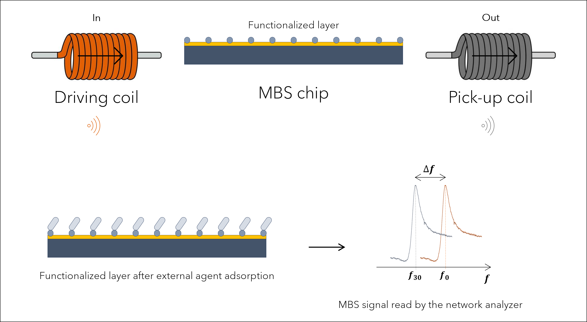
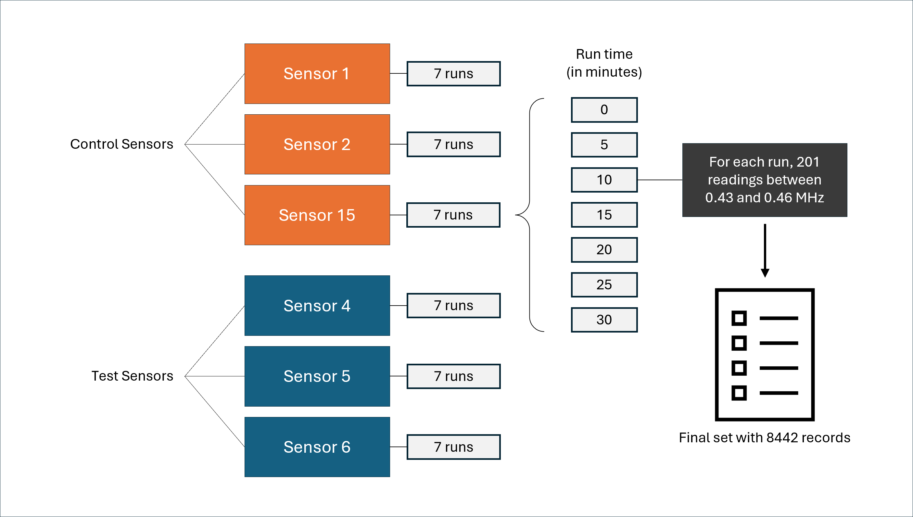
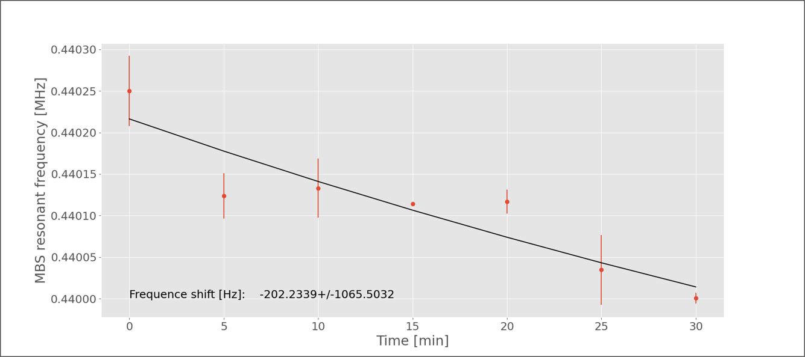

# Summary

Generating, plotting, and analyzing signal data is time-consuming. In a context where the demand for rapid diagnostics is increasing, the assistance of intelligent processes that abstract a significant portion of the work is essential. Analix is a software that reads frequency data generated when magnetoelastic sensors are subjected to an environment containing an external agent (such as SARS-CoV-2). Magnetoelastic sensors have a fundamental vibration frequency, which decreases as their mass increases. In controlled experiments, functionalized magnetoelastic sensors with an active surface were divided into test and control groups. The test sensors were exposed to a medium containing SARS-CoV-2 viruses, and their vibration frequency was collected using a network analyzer, as well as the result of collecting vibrations from the control sensors. The Analix software compared the results, proposing a safe and fast way to provide a diagnosis regarding the presence or absence of an external agent. A machine learning classifier was used to generate a portable model applicable in different scenarios. This work demonstrates the construction of the analysis routine to the final model.


# Statement of need

The primary objective of this project is to develop a software for analyzing data from magnetoelastic sensors, focusing on the efficient detection of pathogens. Utilizing advanced techniques such as statistical data analysis and machine learning algorithms, the software aims to provide a robust tool for the rapid and accurate identification of pathogenic agents, such as viruses and bacteria, which pose threats to public health.

To achieve this overarching goal, the project sets specific targets that include:
- evaluating data from functionalized magnetoelastic sensors to detect the presence of the SARS-CoV-2 virus; 
- developing a predictive model based on the fitting of data curves from a network analyzer;
- establishing a system capable of assessing with high precision the presence or absence of viruses, employing a machine learning classifier algorithm into a Jupyter notebook. 

The relevance of this approach is evident when considering the backdrop of the pandemic scenario that developed between 2020 and 2022, which continues to manifest its effects today, in addition to the increase in dengue cases in Brazil. Such a context has demonstrated the need for tools that enable the rapid diagnosis of certain diseases, such as COVID-19 and other viral infections, to be obtained swiftly, with high detection efficiency and at a reduced cost.

# A brief literature review

Over the past decade, several deadly viral epidemics have had a significant impact on global public health, including outbreaks of Ebola, Marburg, Nipah, Zika, Crimean-Congo hemorrhagic fever, COVID-19, and dengue. These epidemics underscore the need for rapid and accurate detection methods, as well as the development of effective drugs and vaccines [@frieden1:2014; @cdc2:2023; @rougeron3:2015; @cdc4:2023; @yadav5:2019; @who6:2018; @leal7:2017; @paho15:2024].

Sensors made with magnetoelastic materials, combined with machine learning models, can be an ally in the race for rapid detection mechanisms. These sensors are sensitive, precise, and reliable, and can operate over a wide range of temperatures and frequencies. They are also less susceptible to electromagnetic interference and can be integrated into devices with embedded electronics [@cdc8:2023; @bente9:2013; @who10:2022].

Biomedicine is an area that has benefited from sensors constructed from magnetoelastic materials, such as Magnetoelastic Biosensors (MBS). They are applied in monitoring biological parameters and can be used to detect the presence of bacteria and viruses, such as the SARS-CoV-2 coronavirus. The use of machine learning for classification can increase the sensitivity and accuracy of diagnosis [@cdc11:2023; @who12:2023; @ms13:2023; @barreto14:2008].

Magnetoelasticity, like magnetostriction, is a property involving the change in magnetization of ferromagnetic materials due to the application of stress or strain. Magnetostriction, discovered by Joule in 1842, involves the deformation of ferromagnetic materials when exposed to external magnetic fields. Magnetoelasticity is influenced by the magnetostriction constant, the anisotropic constant, and the material’s magnetization, and its sensitivity to stress is maximized when the applied stress approaches $2K/3$. Magnetoelastic sensors (MES) utilize the magnetoelastic effect to measure physical quantities such as stress, pressure, temperature, strain, or electric current. They are manufactured from amorphous metal alloys, commercially known as Metglas 2826MB and Metglas 2605SC, and are capable of detecting mechanical vibrations induced by magnetic fields. These sensors have diverse applications, ranging from wireless monitoring of tires and machine shafts to the detection of vibrations in civil constructions and the monitoring of biological parameters, such as the pH of plasma in the human body [@grimes16:2011; @jackson17:2019; @ausanio18:2005; @vander32:2000; @ludwig33:2002;@cai34:2000; @baran35:2011; @engdahl36:2000; @sablik37:1993; @szewczyk38:2008; @cullen39:2001; @desmione40:2002; @grimes41:2002; @hernando42:1988; @modzelewski43:1981; @jain44:2001; @croce45:2014; @mori46:2021; @khan47:2017; @kouz48:2000; @narita49:2021].

Magnetoelastic sensors exhibit a fundamental frequency, which takes into account the length $(L)$ of the sensor, its modulus of elasticity $(E)$, Poisson’s ratio $(\nu)$, and the density $(\rho)$ of the alloy from which it is made, defined by the following equation [@sisniega50:2020]:

$$f_0 = \frac{1}{2L} \sqrt{\frac{E}{\rho(1 - \nu)}}$$

Artificial intelligence and machine learning are fundamental in enhancing detection and diagnosis using MES. Artificial intelligence enables the development of systems capable of performing tasks that require human intelligence, such as pattern recognition and decision-making. Machine learning, a subfield of artificial intelligence, focuses on developing algorithms that learn from data. Techniques like the bootstrap method, a statistical resampling method, are used to estimate statistics from a data sample, contributing to the analysis and interpretation of sensor signals [@mellit51:2008; @moor52:2006; @mccarthy53:1956; @domingos54:2012; @nilsson56:2013; @bishop57:2006; @macario58:2009; @sas59; @amaral60:2016; @shalev61:2014; @brownlee62:2016; @monard63:2003; @efron69:2000; @davison70:1997].

# Methodology

The sensors, obtained from Metglas 2826MB3 by Metglas Company, were fabricated into dimensions of 5 mm x 1 mm x 28 μm for optimal vibration modes. They were coated with chrome and gold using magnetron sputtering. Measurements were conducted using electromagnetic coils connected to a Keysight E5061B network analyzer and a DC power source, that reads the vibrational behavior of the sensors as a response to de signal from the analizer coils.





A dataset comprising two groups, test and control, each containing data from three sensors, totaling 6 sensors, was assembled. Each sensor underwent a 30-minute measurement cycle using a network analyzer, with data collected every 5 minutes, including t = 0, resulting in 7 subsets of data per sensor, with 201 signal and frequency readings per group. The frequency range tested was between 430,000 Hz and 460,000 Hz, encompassing the characteristic resonance frequency of the sensor material. The final dataset consisted of frequency and signal data from all sensor cycles for each group, totaling 8442 rows. 





A hash column was created as a reference field for analysis, combining group (test or control), sensor number, and time of signal acquisition (T-4-30, for instance). A developed software processed frequency and signal data, capturing values around the estimated peak and fitting an asymmetric Lorentzian curve. The minimum point of this curve was the point of interest for analysis, as it measured the frequency shift used to identify sensor mass changes, indicating the presence of new materials like viruses. Monte Carlo simulation evaluated the statistical significance of the points of interest, with 1000 iterations for each sensor in both groups at each time interval. The resulting dataset contained minimized frequency values and their uncertainties, enabling the plotting of average frequency graphs over time. 


Lagergren's equation was employed to fit the frequency data over time, facilitating a precise comparison of frequency shifts between test and control sensors. The bootstrap method was applied to obtain randomly selected data points for the classifier, generating an 8000-point dataset (4000 for each group). From this dataset, 80% of the data was used as the training subset, and the remaining 20% as the testing subset. An Extreme Gradient Boosting (XGBoost) algorithm was trained and tuned, considering various parameters such as maximum depth, learning rate, and number of estimators, with five-fold cross-validation [@chen67:2016; xgboost68:2024].




# Usage

The application is devided into two parts. First one consists of data analysis routine, that captures data from folders and applies fitting techniques in order to obtain the difference between fundamental frequency (t=0 minutes) and final frequency (t=30 minutes). 
Second part is the classifier routine, that imports the result dataset from analysis script and trains the XGBost algorithm. If one already has delta frequency data, it is possible to use the exported model available at repository to obtain a diagnosis Templates and examples can be found at the [project repository](https://github.com/andreatta-ale/external-agents-detector).

In order to use the software, network analizer results must be inside a folder, splited into two subfolders named *C* and *T* (control and test). Once the notebook is started, after packages are imported, a window pops up, where it is possible to select the main folder where *C* and *T* subfolders are stored. The notebook can be ran cell by cell or in run-all mode. A csv file that can be imported to the classifier routine will be exported to result folder. A file named *I_am_here_to_test_the_model.ipynb* is also available to test results either from full experiment or random results from other sources. 


# Discussion

For the case studied in this project, the adjustment of network analyzer data to the asymmetric Lorentzian model for all sensor datasets resulted in a clustering of parameters from each modeling iteration, accompanied by uncertainty values. This served as the basis for a Monte Carlo simulation, where parameters and uncertainties were applied, producing a dataset optimized for minimum signal value at a specific frequency. Subsequent analysis revealed frequency shifts in test sensor data, which were then adjusted to the Lagergren equation model to obtain $\Delta{f}$ values. These shifts were observable in graphs depicting data curves adjusted to the Lagergren model, highlighting distinctions between sensor groups. 


The Bootstrap method was employed to generate a larger dataset, showcasing significant separation between control and test data means, specially at last run (t=30), despite the presence of an indistinct zone. This expanded dataset was utilized to train an XGBoost classifier model. The model's performance was evaluated using a confusion matrix, revealing overfitting due to the small original dataset. Despite limitations in data availability, the proposed strategy proved effective in differentiating sensor groups, underscoring the importance of predictive technologies in rapidly diagnosing viral diseases. 


Moving forward, this study proposes further exploration by extrapolating analyses to other viruses beyond SARS-CoV-2, and extending applications to detecting harmful bacteria in both medical and veterinary contexts. Additionally, experiments on sensors of different formats are suggested to assess the computational approach's sensitivity to SME geometry variations, offering avenues for future research and development in disease detection and classification. To do so, the source code can be adapted and tested under different sensoring and measurement systems.

# Code review

#### Selecting data folder. It creates result folder for output saving.


```python
root = Tk()
root.withdraw()
folder_path = filedialog.askdirectory()
print('Folder path: ', folder_path)

file_path = os.path.join(folder_path, '**/*.csv')
result_folder = 'res'
folder = os.path.join(folder_path, result_folder)

if os.path.isdir(folder):
    print('Result folder already exists, cleaning...')
    try:
        shutil.rmtree(folder)
    except OSError as e:
        print(f"Error: {folder} : {e.strerror}")
os.mkdir(folder)
print('Result folder created.')

print('-----------------------------------------\n')
print('Result folder path: ', folder)
print('-----------------------------------------\n')

### Logging
log_file = os.path.join(folder, 'log.txt')

with open(log_file, 'w') as f:
    f.write(f"{datetime.now()} - {folder}")
```


    Folder path:  C:/Users/my_user/Documents/Analix/...
    Result folder already exists, cleaning...
    Result folder created.
    -----------------------------------------
    
    Result folder path:  C:/Users/my_user/Documents/Analix/...
    -----------------------------------------
    
    
#### Acquiring individual files addresses. 
Splits into group, sensor and time, adding a hash column used for filtering data.


```python
files = pd.DataFrame(glob.glob(file_path,recursive = True),columns = ['Path'])

def extract_info(path):
    group = path.split('/')[-1].split('\\')[-3]
    sensor = path.split('/')[-1].split('\\')[-2]
    k = path.rfind('\\')
    time = int(path[k + 1:].replace('.CSV', ''))
    hash = f"{group}-{sensor}-{time}"
    return pd.Series([group, sensor, time, hash])

files[['group', 'sensor', 'time', 'hash']] = files['Path'].apply(extract_info)

addresses = files.rename(columns={'Path': 'address'}).sort_values(
    by=['group','sensor','time','address'], 
    ignore_index=True, 
    ascending=True
)

print('-----------------------------------------\n')

text = 'Analysis'

print(text + '\n')

print('-----------------------------------------\n')

addresses.head()
```

    -----------------------------------------
    
    Analysis
    
    -----------------------------------------
    


#### Scans the addresses data frame
Reads data of each file and assembles them into a combined data frame, that contains frequency and signal data. 
Also, rescales frequency values to signal's order of magnitude (multiplied by $1 \times 10^{-6}$)


```python
def process_path(path):
    group = addresses.loc[path,'group']
    sensor = addresses.loc[path,'sensor']
    time = addresses.loc[path,'time']
    hashed = addresses.loc[path,'hash']

    df_import = pd.DataFrame(pd.read_csv(path, skiprows=range(0, 2)))
    df_import.drop(df_import.columns[2], axis=1, inplace=True)
    df_import.columns.values[0] = 'frequency'
    df_import.columns.values[1] = 'signal'
    df_import['group'] = group
    df_import['sensor'] = sensor                                          
    df_import['time'] = time
    df_import['hash'] = hashed

    return df_import

dfs = addresses.index.map(process_path)
combined_df = pd.concat(dfs, ignore_index=True)

combined_df['frequency'] = combined_df['frequency'] * 1.e-6
combined_df.head()
```


Split Lorentzian function, used to fit data to model:

$f(x; A, \mu, \sigma, \sigma_r) = \frac{2 A}{\pi (\sigma+\sigma_r)} \big[\frac{\sigma^2}{(x - \mu)^2 + \sigma^2} * H(\mu-x) + \frac{\sigma_r^2}{(x - \mu)^2 + \sigma_r^2} * H(x-\mu)\big] + (m x + b)$

The designed function fits model to data (Lorentzian) to each experimental dataset, retrieving an evaluation dataset based on the model. After fitting, an optimization function is appplied over a Monte Carlo Simulation to find the interesting point: the minimized frequency used to evaluate delocation on passing time of experiment. 

For each instance of time, a graph of original data, accuracy rate between Monte Carlo Simulation average frequency and minimized average frequency, and fitted curve over original data is ploted, pinpointing those values alongside minimal point from original data.

#### Running the fit model builder:


```python
eval_df, param_df = process_data(combined_df, log_file)
```

Fist outputs:

    [[Model]]
        (Model(linear) + Model(split_lorentzian))
    [[Fit Statistics]]
        # fitting method   = leastsq
        # function evals   = 57
        # data points      = 26
        # variables        = 6
        chi-square         = 1.0762e-06
        reduced chi-square = 5.3809e-08
        Akaike info crit   = -430.004968
        Bayesian info crit = -422.456389
        R-squared          = 0.99987217
    [[Variables]]
        amplitude: -6.5548e-04 +/- 1.1665e-05 (1.78%) (init = 0.000562349)
        center:     0.43904624 +/- 6.0215e-06 (0.00%) (init = 0.4389636)
        sigma:      0.00229330 +/- 3.7278e-05 (1.63%) (init = 0.0025)
        sigma_r:    0.00216150 +/- 2.9597e-05 (1.37%) (init = 0.0025)
        fwhm:       0.00445480 +/- 4.0914e-05 (0.92%) == 'sigma+sigma_r'
        height:    -0.09367237 +/- 8.2562e-04 (0.88%) == 
            '2*amplitude/3.1415927/max(0.0000000, (sigma+sigma_r))'
        slope:     -4.08629682 +/- 0.23477583 (5.75%) (init = 0)
        intercept:  2.36979826 +/- 0.10330544 (4.36%) (init = 0.4819135)
    [[Correlations]] (unreported correlations are < 0.250)
        C(slope, intercept)     = -1.0000
        C(sigma, intercept)     = +0.8389
        C(sigma, slope)         = -0.8350
        C(amplitude, sigma)     = -0.7051
        C(sigma_r, slope)       = +0.6686
        C(sigma_r, intercept)   = -0.6631
        C(center, sigma_r)      = -0.5404
        C(amplitude, sigma_r)   = -0.4793
        C(center, sigma)        = +0.4013
        C(center, slope)        = -0.3272
        C(center, intercept)    = +0.3261
        C(amplitude, intercept) = -0.2817
        C(amplitude, slope)     = +0.2739
        C(sigma, sigma_r)       = -0.2681
    
    
    ----- Results -----
    ---------------------------------------------  ----------------------
    Optimized frequency mean (fmin)                0.4391199030496987
    Optimized frequency standard deviation (fmin)  2.1337644445234708e-05
    Optimized frequency standard error (fmin)      6.747555634978163e-07
    Optimized frequency mean with uncertainties    439120+/-21
    Accuracy of estimated frequency mean / SMC     0.9999343005633774
    ---------------------------------------------  ----------------------

   


    

    


    Eval appended.
    --------------------------------
    
    (...)


In order to obtain a model for frequency decay over time, a Lagergren model is applied over minimized data. A detailed report on fit params of the model is displayed. 


       

    


    Summary - Sensor 1  - Control
    ----------------------  -------------------------
    Parameter f0            0.439119680+/-0.000003752
    Parameter a             (1.5927+/-0.9714)e-05
    Parameter c             0.1819+/-0.2855
    Frequency t = 30 [MHz]  0.439112716+/-0.000005673
    Frequency shift [Hz]    -6.9639640+/-4.2551698
    ----------------------  -------------------------
    
    [[Model]]
        Model(fit_model)
    [[Fit Statistics]]
        # fitting method   = leastsq
        # function evals   = 5
        # data points      = 7
        # variables        = 3
        chi-square         = 5.7280e-11
        reduced chi-square = 1.4320e-11
        Akaike info crit   = -172.702881
        Bayesian info crit = -172.865151
        R-squared          = 0.40421449
    [[Variables]]
        f0:  0.43911968 +/- 3.7519e-06 (0.00%) (init = 0.4391197)
        a:   1.5927e-05 +/- 9.7142e-06 (60.99%) (init = 1.592128e-05)
        c:   0.18193020 +/- 0.28553067 (156.95%) (init = 0.1820259)
    [[Correlations]] (unreported correlations are < 0.100)
        C(f0, a) = +0.8246
        C(f0, c) = +0.3355

#### Classification model

As result of this process, a CSV file containing information of delta frequency at every time is exported. Once the CSV file is imported into the *Classifier.ipynb* file, the Bootstrap method will be applied to data, wich were splitted into test and control subsets. It helps to keep the main dataset balanced at the end of bootstrapping process. 
The model is trained

```python
# Train-test split
X = bootstrapped.iloc[:, 1:]  # Features
y = bootstrapped.iloc[:, 0]   # Labels

X_train, X_test, y_train, y_test = train_test_split(X, y, test_size=0.20, random_state=42)

X_train

from xgboost import XGBClassifier
from sklearn.metrics import make_scorer, accuracy_score, precision_score, recall_score, f1_score
from sklearn.model_selection import GridSearchCV
import xgboost as xgb
import joblib

# Difining params for optimization
parameters = {
    'objective': ['binary:logistic'],
    'max_depth': [3, 4, 5, 6],
    'learning_rate': [0.001, 0.01, 0.1, 0.2],
    'n_estimators': [50, 100, 200, 300]
}

scoring = {
    'accuracy': 'accuracy',
    'precision': make_scorer(precision_score),
    'recall': make_scorer(recall_score),
    'f1': make_scorer(f1_score)
}

# Creating the model
xgb_clf = xgb.XGBClassifier()

# Creating GridSearchCV with diverse metrics
grid_search = GridSearchCV(
    estimator=xgb_clf, 
    param_grid=parameters, 
    scoring=scoring, 
    refit='accuracy', 
    cv=5
)

# Fitting train data to the model
grid_search.fit(X_train, y_train)

# Evaluation results
results = grid_search.cv_results_

# Best hyperparams
best_params = grid_search.best_params_
print(f'Melhores parâmetros: {best_params}')

# Printing scores
for scorer in scoring:
    print(f"{scorer} scores:")
    print(results[f'mean_test_{scorer}'])

# Saving XGBoost model 
joblib.dump(grid_search, './data/source_data/res/xgboost_model.joblib')
```

After training the classifier algorithm, it is possible to test it just by importing the model to another jupyter notebook (*I_am_here_to_test_the_model.ipynb* file is available for that end).


```python
# Read the CSV file into a DataFrame
analysis_data = pd.read_csv('results_to_submit.csv')

# Convert the DataFrame to list
data_to_submit = analysis_data.values.tolist()

loaded_model = joblib.load('./data/source_data/res/xgboost_model.joblib')

# Convert the data to a numpy array and make a prediction
new_test_data = np.array(data_to_submit[5][-2:])

# Data sampling for testing model as imported 
#(delta frequency and standard deviation):
# data_to_submit = [-102.67478924215538, 23.69349016343144]


# Making predicions
prediction = loaded_model.predict(new_test_data.reshape(1, -1))

# Print the prediction
if prediction[0] == 1:
    print(f"External agent detected, prediction for XGB is {prediction.item()} - positive")
else:
    print(f"External agent not detected, prediction for XGB is {prediction.item()} - negative")
```
    External agent detected, prediction for XGB is 1.0 - positive

# Acknowledgements

The authors gratefully acknowledge the Coordination for the Improvement of Higher Education Personnel (CAPES) for providing essential resources for this research. They also thank the University of Caxias do Sul (UCS) for the opportunity to conduct this study. Additionally, they extend their thanks to all colleagues who contributed to this work, directly or indirectly.

# References